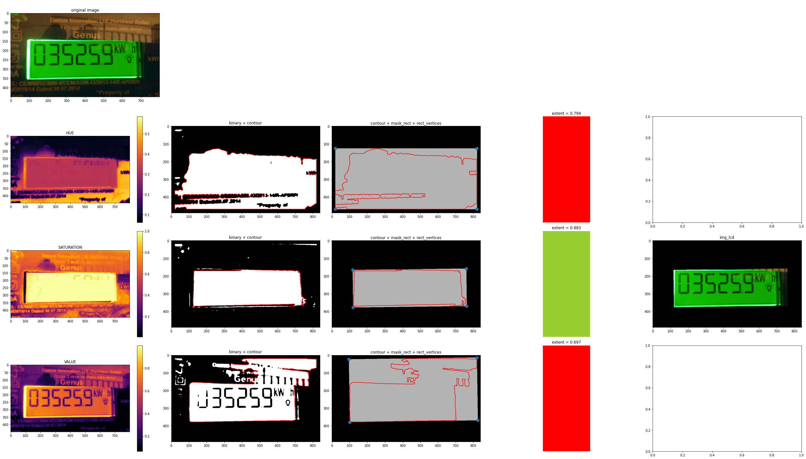

# Computer Vision based Extraction of LCD-Region of Digital Electric Meters for Digit Recognition

# Abstract
This repository describes a simple computer vision based method to extract the LCD screen region from real-world images of smart energy/electricity meters. It is a preliminary preprocessing step in an image processing pipeline which aims at performing seven-segment digit recognition.  

## References
- Karthick Kanagarathinam and Kavaskar Sekar (2019). 
[Text detection and recognition in raw image dataset of seven segment digital energy meter display.](https://www.sciencedirect.com/science/article/pii/S235248471930174X).   
Energy Reports, volume 5, 842-852.  
- [Pyimagesearch, Recognizing digits with OpenCV and Python.](https://pyimagesearch.com/2017/02/13/recognizing-digits-with-opencv-and-python/)  